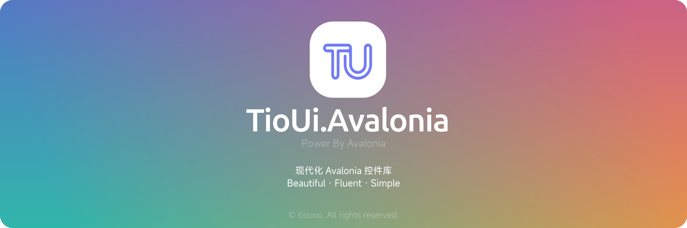

<p align="center">

</p>

<div align="center">

# YikUi.Avalonia

**现代化 Avalonia 控件库**

[](LICENSE)
[](https://dotnet.microsoft.com/)
[](https://avaloniaui.net/)


</div>

## 📖 项目简介

YikUi 二次修改于 [Semi.Avalonia](https://github.com/irihitech/Semi.Avalonia) 和 [Ursa.Avalonia](https://github.com/irihitech/Ursa.Avalonia)

## ✨ 特性

- 🎨 **现代设计** - 采用流畅设计语言，注重视觉层次和交互反馈
- 🧩 **丰富组件** - 提供精心设计的 UI 组件
- 🌈 **主题系统** - 内置亮色/暗色主题，支持自定义主题
- 🌍 **国际化** - 内置中英文支持，可扩展多语言

## 🎯 设计理念

YikUi 的设计风格融合了现代 UI 设计的精髓：

- **流畅性** - 平滑的动画过渡和交互反馈
- **一致性** - 统一的视觉语言和交互模式

## 📦 安装

### 通过 NuGet 安装

```bash
dotnet add package YikUi.Avalonia
```

### 引入 dll

下载

### 手动安装

1. 克隆仓库

```bash
git clone https://github.com/yiikooo/YikUi.Avalonia.git
```

2. 在你的项目中添加引用

```xml
<ProjectReference Include="path/to/YikUi/YikUi.csproj" />
```

## 🚀 快速开始

### 配置 App.axaml

在你的应用程序中引入 YikUi 主题：

```xaml
<Application x:Class="YourApp.App"
             xmlns="https://github.com/avaloniaui"
             xmlns:x="http://schemas.microsoft.com/winfx/2006/xaml"
             xmlns:yik="https://github.com/yiikooo/YikUi.Avalonia">
    <Application.Styles>
        <!-- 引入 YikUi 主题 -->
        <yik:YikUiTheme />
    </Application.Styles>
</Application>
```

### 设置语言与主题色（可选）

```xaml
<yik:YikUiTheme Language="zh_cn" ThemeColor="CornflowerBlue" />
```

或在CodeBehide设置

```csharp
using YikUi.Common.Language;

public class App : Application
{
    public override void OnFrameworkInitializationCompleted()
    {
        // 设置默认语言为简体中文
        LangManager.SetLanguage(Languages.zh_cn);

        // 或设置为英语
        // LangManager.SetLanguage(Languages.en_us);
        
        // 设置主题色
        var yikTheme = Application.Current?.Styles
                .OfType<YikUiTheme>()
                .FirstOrDefault();
            yikTheme?.SetThemeColor(Colors.CornflowerBlue);

        base.OnFrameworkInitializationCompleted();
    }
}

// 或在运行时切换
public void SetLanguage()
{
    LangManager.SetLanguage(Languages.en_us);
}
```

#### 自定义语言

在你的项目中创建一个新类，实现 `ILang` 接口：

```csharp
using YikUi.Common.Language;

namespace YourApp.Languages;

public class LangJaJp : ILang
{
    public string Name => "名前";
    public string FileName => "ファイル名";
    public string UpdateAt => "更新日時";
    public string Type => "種類";
    ...
}
```

使用自定义语言

```csharp
using YikUi.Common.Language;
using YourApp.Languages;

// 在应用启动时设置
public class App : Application
{
    public override void OnFrameworkInitializationCompleted()
    {
        // 使用自定义语言
        LangManager.SetLanguage(new LangJaJp());

        base.OnFrameworkInitializationCompleted();
    }
}

// 或在运行时切换
public void SwitchToJapanese()
{
    LangManager.SetLanguage(new LangJaJp());
}
```

## 📚 组件列表

YikUi 提供了丰富的组件库，涵盖基础组件、数据展示、导航、数据录入、反馈、布局等多个类别。

包括但不限于：Button、Input、DatePicker、ColorPicker、Table、Tree、Menu、Tabs、Dialog、Notification、Layout、Grid 等常用组件。

完整的组件列表和使用方法请查看示例项目。

## 🎯 示例项目

YikUi 提供了一个完整的示例项目，展示了所有组件的用法：

```bash
cd src/YikUi.Demo
dotnet run
```

示例项目包含：

- 所有组件的演示
- 主题切换功能
- 语言切换功能
- 响应式布局示例
- 最佳实践参考

## 🤝 贡献

我们欢迎所有形式的贡献！无论是报告 bug、提出新功能建议，还是提交代码，都非常感谢。

## ❤️ 致谢

YikUi 的开发受到了以下优秀项目的启发：

- [Semi.Avalonia](https://github.com/irihitech/Semi.Avalonia)
- [Ursa.Avalonia](https://github.com/irihitech/Ursa.Avalonia)
- [SukiUI](https://github.com/kikipoulet/SukiUI)

## 📄 许可证

本项目采用 [MIT](LICENSE) 许可证。
